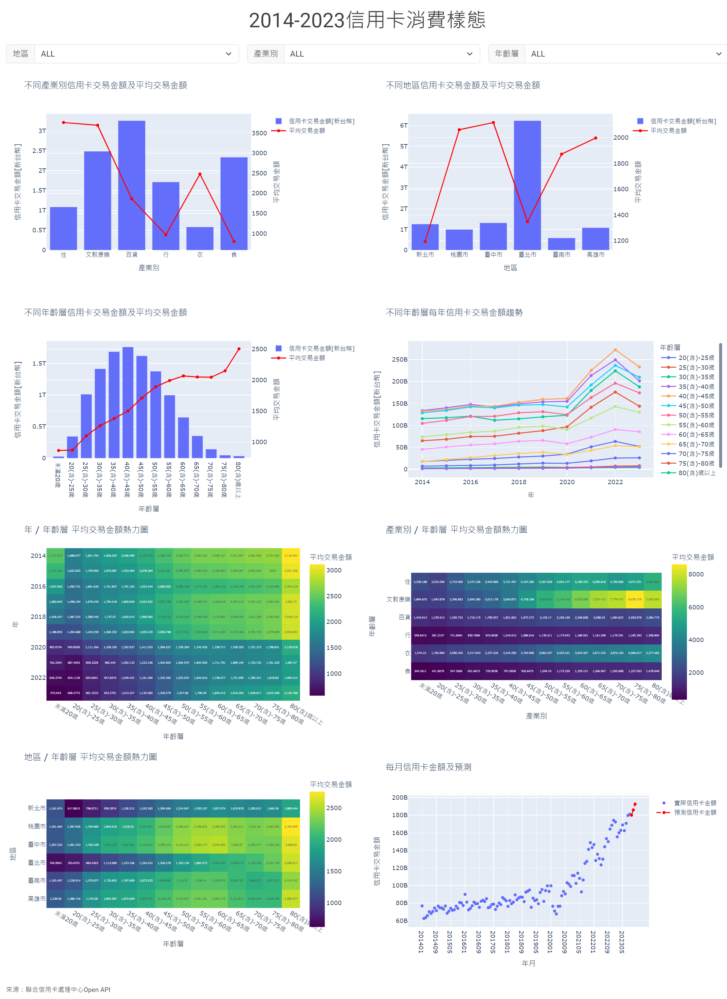
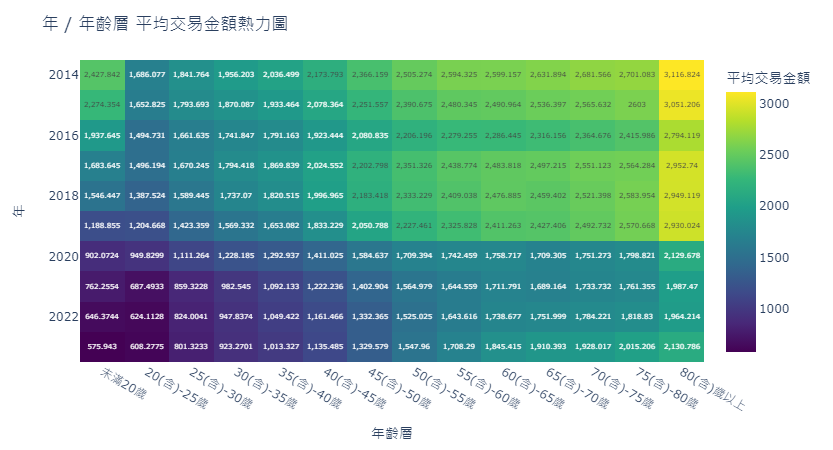
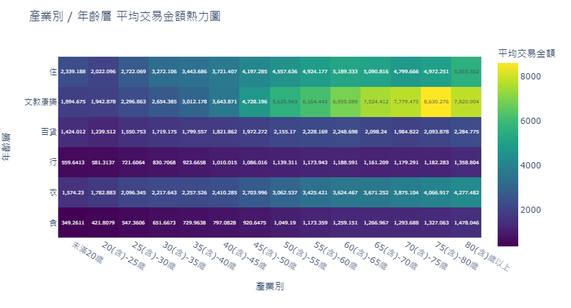
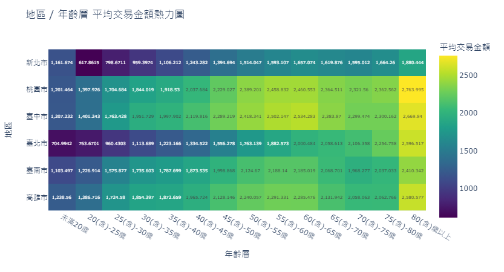

# 信用卡消費樣態

###### 連結：[2014-2023信用卡消費樣態](https://dash-ml-knot.onrender.com)

## Dash

## 說明
依不同需求，選擇相應資料：
1. 地區 [六都]：臺北市 | 新北市 | 桃園市 | 臺中市 | 臺南市 | 高雄市 | ALL

2. 產業別：食 | 衣 | 住 | 行 | 文教康樂 | 百貨 | ALL

3. 年齡層：未滿20歲－80歲以上 [以五歲為間距]

圖表說明：  
一、長條圖及折線圖 [圖表會隨著篩選按鈕變化而變化]  
1. 不同產業別信用卡交易金額及平均交易金額  
長條圖是顯示各產業別的信用卡交易金額，可以看出消費主要集中在百貨業。折線圖是顯示平均交易金額，可以看出以住及文教康樂較高。  
[ 下圖呈現選擇ALL與點選百貨的圖表差異，點選百貨則百貨的長條圖會亮起。 ]
   

2. 不同地區信用卡交易金額及平均交易金額  
長條圖是顯示各地區的信用卡交易金額，可以看出消費主要集中在台北市。折線圖的部分是顯示平均交易金額，可以看出以台中市及桃園市較高。  
[ 下圖呈現選擇ALL與點選臺北市的圖表差異，點選臺北市則臺北市的長條圖會亮起。 ]

3. 不同年齡層信用卡交易金額及平均交易金額  
長條圖是顯示各年齡層的信用卡交易金額，可以看出消費主要集中在35歲至55歲之間。折線圖為平均交易金額，可以看出隨年齡成長，單筆交易金額也隨之成長，80歲以上的單筆信用卡交易金額為最高。  
[ 下圖呈現選擇ALL與點選30-35歲的圖表差異，點選30-35歲則30-35歲的長條圖會亮起。 ]

4. 不同年齡層每年信用卡交易金額趨勢  
顯示各年齡層每一年的信用卡交易金額趨勢，可以看出信用卡金額呈現逐年成長的趨勢，由於目前資料蒐集僅至2023年9月，因此趨勢線在2023年的部分呈現下降趨勢。  
[ 下圖呈現選擇ALL與點選30-35歲的圖表差異，點選30-35歲圖表僅顯示30-35歲每年信用卡交易的趨勢。 ]
 

二、熱力圖  
1. 年 / 年齡層信用卡平均交易金額熱力圖   
顯示各年齡層每年信用卡單筆交易金額，可以看出2014-2019平均交易金額在2000-3000左右，疫情後人們消費型態改變，使用信用卡交易次數增加，因此單筆消費金額也隨之下降。而就整體趨勢而言，可看出單筆消費金額的高低與年齡成正比。

2. 產業別 / 年齡層信用卡平均交易金額熱力圖  
顯示各年齡層在各產業中單筆交易金額，可以看出以住及文教康樂較高。其中，住的部分又以80歲以上為最高，文教康樂以75-80歲為最高。

3. 地區 / 年齡層 信用卡平均交易金額熱力圖  
顯示各年齡層在六都的單筆交易金額，可以看出以台中市及桃園市較高。兩地區單筆消費金額最高的年齡皆為80歲以上，其次為60-65歲。

三、模型  
1. 多元線性迴歸模型  
顯示2014年1月份至2023年9月份期間每月份的信用卡交易金額及趨勢，由圖可觀察出信用卡交易金額逐年增加，則最後三個紅點為透過多元線性迴歸模型預測出10,11,12三個月份的信用卡交易金額。

# 專題目的
感於近年來受疫情影響，國人消費形態及支付方式改變，網路交易及外送盛行，希望藉由國人消費様態分析作為發卡及收單機構推廣特約商店及行銷推廣之參考，並預估下月份之信用卡消費金額。
# 資料說明
1. 資料來源：聯合信用卡處理中心 OPEN API
2. 資料範圍：2014年1月 - 2023年9月
3. 程式集：main_ML.py、dash_ML.py、dataview.ipynb